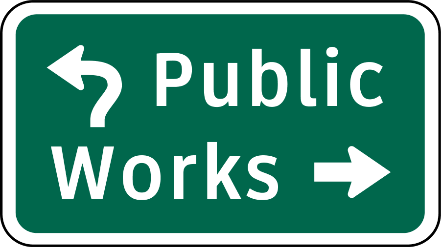

# Public Works

## Hack Club Roulette Spins

- **Camera:** 2D Isometric
  - Although the game is 3D, the camera is orthographic and placed at an angle so the game appears isometrically.
- **Gameplay:** Puzzle
  - There are different levels of different towns, all without roads. You are tasked with placing road pieces in a way that every building connects to one garage.
- **Setting:** Urban
  - The game is themed around building a city's road infrastructure.
